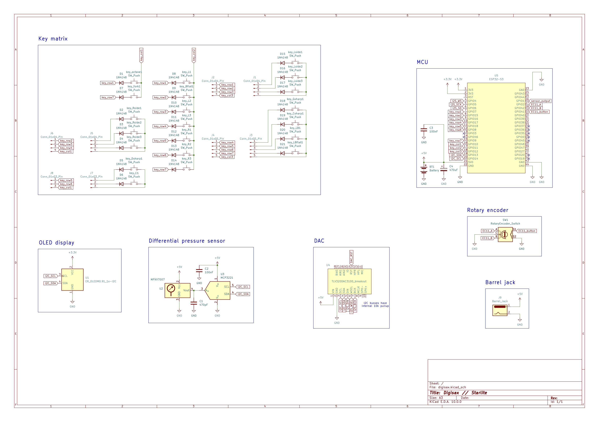
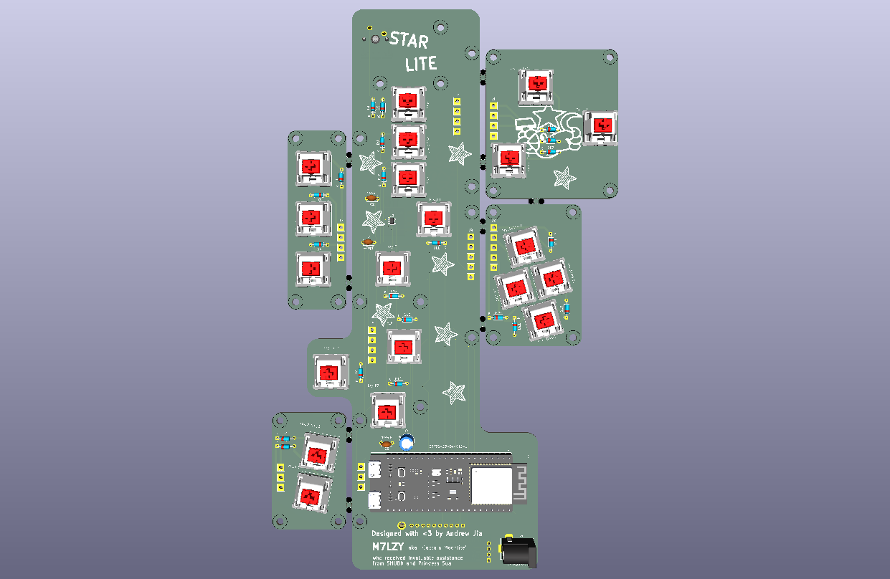
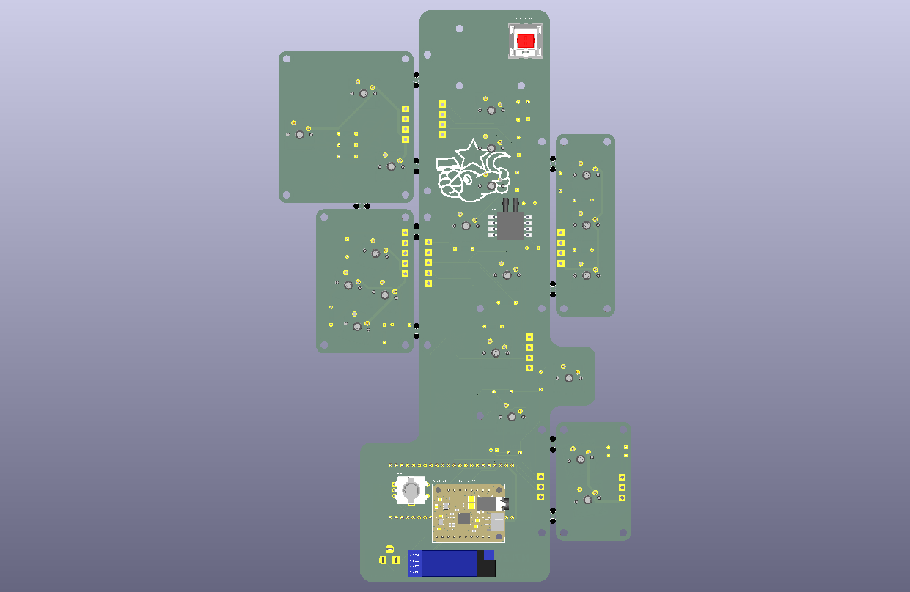
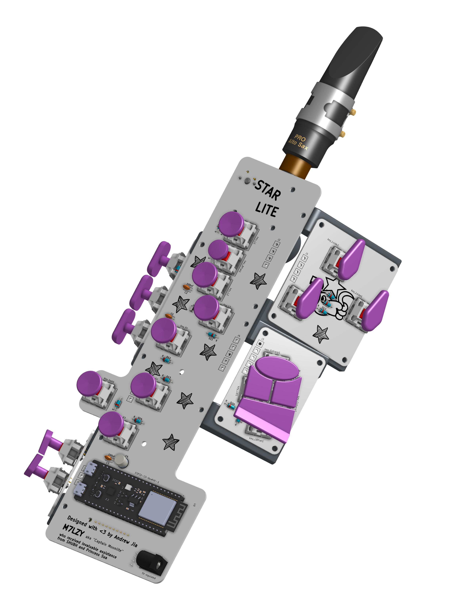
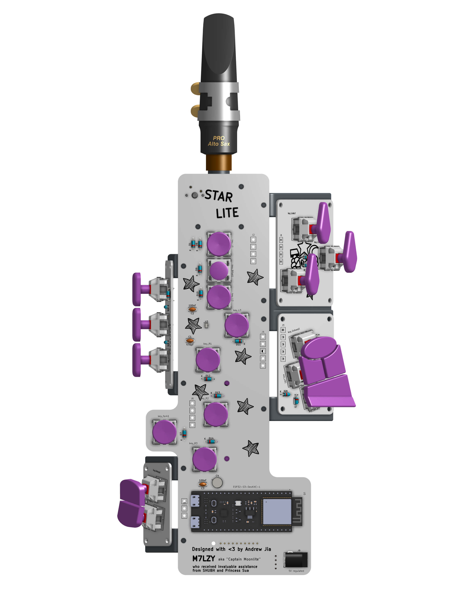
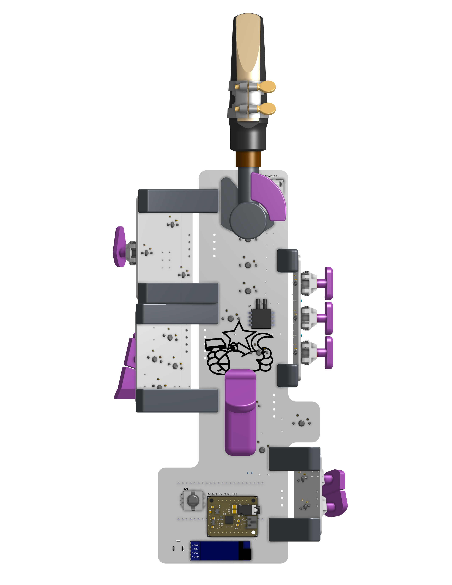
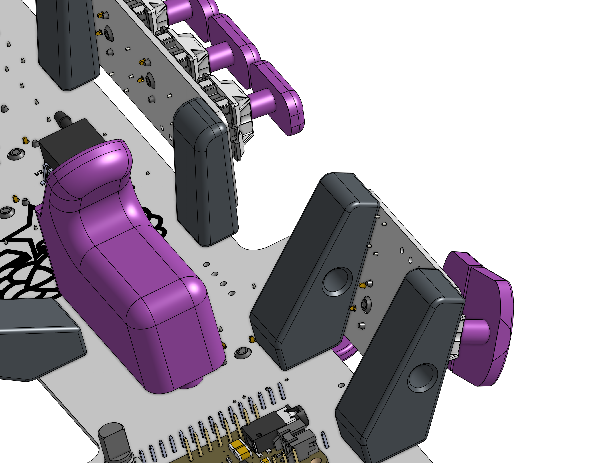

# STARLITE


## Description
STARLITE is a minimalist Digital Saxophone (Digisax) controlled by ESP32-S3.

Features:
- realistic ergonomics
- UI in the form of an OLED display and rotary encoder, to control master volume and timbre
- differential pressure sensor for responsive breath control
- pressure tube and bleed tube to simulate realistic resistance to blowing
- audio synthesised locally
- 3x7 key matrix featuring MX Black switches
- power via 5V barrel jack
- headphone output

The neck can be blown into directly, but an alto saxophone mouthpiece is recommended. (Not included in this project.)

OnShape link: https://cad.onshape.com/documents/a64dba8dfd86a5efa1851173/w/8b62b2d00aa632cf961d9b4c/e/8ecfcb79b78c17c244b3f0aa

## Schematic and PCB


A pdf version can be found in the pcb/ directory.



PCB front



PCB back

An unrouted, fragmented pcb can be found in the pcb directory. A routed, panelised pcb can be found in startlite_production_pcb. Gerber files were gerated from the latter.

## Assembly
1. All parts can be handsoldered. I recommend soldering the key-switches last.
2. 3D printed parts to contain M3 heatset inserts.
3. Cut two lengths of food grade silicone tubing, 70mm (pressure tube) and 240mm (bleed tube) in length.
4. All plumbing is a push fit. Connect the pressure tube between the neck and pressure sensor. Bleed tube carries condensation from the neck to the bottom of the instrument. Holes in the right-hand-pinky-keys can hold the bleed tube in place.
5. All keycaps are a push fit. See images at bottom of page for correct placement.
6. Wrap cork around the neck to ensure an airtight fit with the mouthpiece.

3D printed parts:

|Quantity|Description|
|-|-|
|1|key B|
|1|key B-flat|
|1|key C-sharp|
|1|key G-sharp|
|3|key left palm|
|1|key low B flat|
|1|key Octave|
|3|key right palm|
|2|key right pinky|
|7|key round|
|1|mount left|
|1|mount left palm|
|1|mount left pinky|
|2|mount right palm|
|2|mount right pinky|


## BOM
|Quantity|Total cost/GBP|Description|MPN|Suggested source|
|-|-|-|-|-|
|1|16.88|PCB|-|https://jlcpcb.com/|
|1|6.30|DAC amplifier|Adafruit TLV320DAC3100 breakout board|https://thepihut.com/products/adafruit-tlv320dac3100-i2s-dac-with-headphone-and-speaker-out|
|1|10.40|MCU|ESP32-S3-DevKitC-1|https://www.aliexpress.com/item/1005009298826918.html|
|1|5.73|Differential pressure sensor|MPXV7007DP|https://www.aliexpress.com/item/1005009368234291.html|
|1|1.43|I2C ADC|MCP3221|https://www.mouser.co.uk/ProductDetail/Microchip-Technology/MCP3221A7T-E-OT?qs=uHi2%2FQoPa5B%2FLE1GKuvdgg%3D%3D|
|21|23.49 (30pcs)|Keyboard switches|Cherry MX Black|https://www.ebay.co.uk/itm/203537430495?_skw=mx+black+switch|
|1|3.80|0.91" OLED display|SSD1306|https://www.aliexpress.com/item/1005006365845676.html|
|1|1.16|rotary encoder|EC11|https://www.aliexpress.com/item/1005005983134515.html|
|1|0.80|Barrel jack|DC-005|https://www.aliexpress.com/item/4001206395694.html|
|21|2.27|Diode|1N4148|https://www.aliexpress.com/item/1005010526571917.html|
|4|3.00|Capacitors|470pF, 100nF, 470uF|https://www.digikey.co.uk/|
|29|5.75 (50 pcs)|Screw M3|M3 * 12 Phillip's head|https://www.ebay.co.uk/itm/221326204336|
|29|8.88 (100 pcs)|Heat-set insert M3|M3 * 4 * 4.5|https://www.ebay.co.uk/itm/376068195160|
|1|3.20|Food grade silicone hose|ID 3mm OD 5mm length 1mm|https://www.ebay.co.uk/itm/227352704780?var=526554578797|
|1|5.44|cork sheet|~2mm thickness|https://www.ebay.co.uk/itm/277911247699|
|-|10|3D printed parts|-|-|
|TOTAL|108.53|-|-|-|


## Code

Firmware is written in C++.

Column pins use the ESP-32's internal pullup, and all row pins are set to high. I implemented a loop where all the rows are pulled high by default, and any column which is detected as low is matched with the key's corresponding row.

At the moment the code detects simultaneous key presses and prints the note which the current fingering corresponds to. Matrix and fingering mappings can be found in the code/ directory.

Note synthesis and volume control via the rotary encoder will be implemented once the project is built.

```cpp
#include <Arduino.h>
#include <map>
#include <initializer_list>

// =====================
// MATRIX PINS
// =====================

int Rows[] = {7, 15, 16, 17, 18, 8, 9};
int Columns[] = {10, 11, 12};

// =====================
// KEY NAMES
// =====================

const char* saxKey[7][3] =
{
    {"Octave1","L1","Ls1"},
    {"fork1","Bf1","Ls2"},
    {"Rs1","L2","Ls3"},
    {"Rs2","L3","Gsh1"},
    {"Rs3","R1","Csh1"},
    {"Dsh1","R2","LB1"},
    {"C1","R3","LBf1"}
};

// =====================
// BIT POSITIONS
// =====================

enum KeyBits
{
    OCTAVE1,
    L1,
    LS1,
    FORK1,
    BF1,
    LS2,
    RS1,
    L2,
    LS3,
    RS2,
    L3,
    GSH1,
    RS3,
    R1,
    CSH1,
    DSH1,
    R2,
    LB1,
    C1,
    R3,
    LBF1
};

// =====================
// KEY -> BIT LOOKUP
// =====================

std::map<String, uint8_t> keyToBit =
{
    {"Octave1", OCTAVE1},
    {"L1", L1},
    {"Ls1", LS1},
    {"fork1", FORK1},
    {"Bf1", BF1},
    {"Ls2", LS2},
    {"Rs1", RS1},
    {"L2", L2},
    {"Ls3", LS3},
    {"Rs2", RS2},
    {"L3", L3},
    {"Gsh1", GSH1},
    {"Rs3", RS3},
    {"R1", R1},
    {"Csh1", CSH1},
    {"Dsh1", DSH1},
    {"R2", R2},
    {"LB1", LB1},
    {"C1", C1},
    {"R3", R3},
    {"LBf1", LBF1}
};

// =====================
// FINGERING TABLE
// =====================

std::map<uint32_t, float> waves;

// =====================
// CREATE BITMASK
// =====================

uint32_t makeMask(std::initializer_list<uint8_t> keys)
{
    uint32_t mask = 0;

    for(auto key : keys)
    {
        mask |= (1UL << key);
    }

    return mask;
}

// =====================
// SETUP
// =====================

void setup()
{
    Serial.begin(115200);

    // Row pins output
    for(int i = 0; i < 7; i++)
    {
        pinMode(Rows[i], OUTPUT);
        digitalWrite(Rows[i], HIGH);
    }

    // Column pins input pullup
    for(int i = 0; i < 3; i++)
    {
        pinMode(Columns[i], INPUT_PULLUP);
    }

    // =====================
    // NOTE TABLE
    // =====================

    waves[makeMask({L1,L2,L3,R1,R2,R3,C1,LBF1})] = 138.59;
    waves[makeMask({L1,L2,L3,R1,R2,R3,C1,LB1})]  = 146.83;
    waves[makeMask({L1,L2,L3,R1,R2,R3,C1})]      = 155.56;
    waves[makeMask({L1,L2,L3,R1,R2,R3,C1,CSH1})] = 164.81;
    waves[makeMask({L1,L2,L3,R1,R2,R3})]         = 174.61;
    waves[makeMask({L1,L2,L3,R1,R2,R3,DSH1})]    = 185.00;
    waves[makeMask({L1,L2,L3,R1,R2})]            = 196.00;
    waves[makeMask({L1,L2,L3,R1})]               = 207.65;
    waves[makeMask({L1,L2,L3,R2})]               = 220.00;
    waves[makeMask({L1,L2,L3})]                  = 233.08;
    waves[makeMask({L1,L2,L3,GSH1})]             = 246.94;
    waves[makeMask({L1,L2})]                     = 261.63;
    waves[makeMask({L1,BF1})]                    = 277.18;
    waves[makeMask({L1})]                        = 293.66;
    waves[makeMask({L2})]                        = 311.13;
    waves[makeMask({})]                          = 329.63;

    Serial.println("Digital Sax Ready");
}

// =====================
// LOOP
// =====================

void loop()
{
    uint32_t currentMask = 0;

    // Scan all rows
    for(int row = 0; row < 7; row++)
    {
        // Disable all rows
        for(int r = 0; r < 7; r++)
        {
            digitalWrite(Rows[r], HIGH);
        }

        // Activate one row
        digitalWrite(Rows[row], LOW);

        delayMicroseconds(50);

        // Read columns
        for(int col = 0; col < 3; col++)
        {
            if(digitalRead(Columns[col]) == LOW)
            {
                const char* keyName = saxKey[row][col];

                currentMask |=
                    (1UL << keyToBit[String(keyName)]);

                Serial.print("Pressed: ");
                Serial.println(keyName);
            }
        }
    }

    // Lookup note
    auto note = waves.find(currentMask);

    if(note != waves.end())
    {
        Serial.print("Frequency: ");
        Serial.println(note->second);
    }
    else
    {
        Serial.println("Unknown fingering");
    }

    Serial.println("----------------");

    delay(50);
}
```

## Acknowledgements <3

Massive thank you to Rehan for sacrificing his sleep to write the firmware.

Also to Sua for designing a BANGING zine.

## More images








