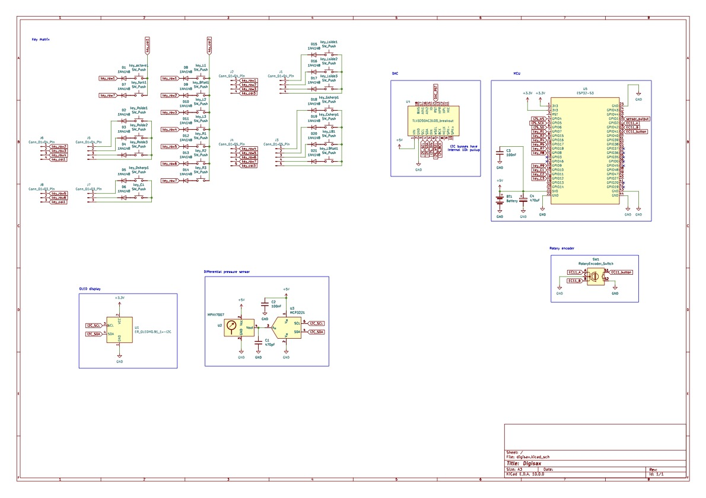

# Digisax WORK IN PROGRESS!

Will be completed before the end of June

ESP32 controlled wind synth

# Schematic

See images/digisax_schematic.pdf for better resolution image

# Description
- ESP32-S3-DevKitC-1 microcontroller
- keys arranged in a matrix of 3 Columns * 7 Rows
- breath sensor consisting of MPXV7007 differential pressure sensor + mcp3221 ADC to communicate over I2C
- rotary encoder to adjust volume

## BOM
|Quantity|Description|Identifier|Source|
|-|-|-|-|
|1|DAC amplifier|MAX98357A I2S|-|
|1|MCU dev-board|ESP32-S3-DevKitC-1|-|
|1|Differential pressure sensor|MPXV7007DP|-|
|1|I2C ADC|mcp3221|
|-|Keyboard switches|Cherry MX Black|-|
|1|0.91" OLED display|-|-|
|1|rotary encoder|EC11|-|
